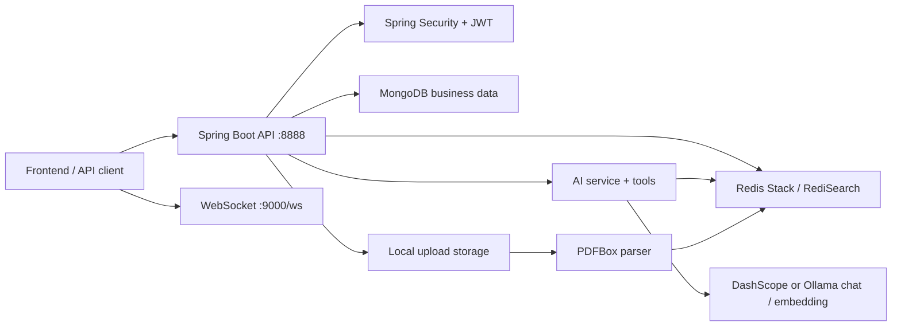

# Flowdesk

[](https://github.com/evans778-star/flowdesk/actions/workflows/ci.yml)


> AI office automation backend template with Spring Boot 3, Java 21, DashScope/Ollama, MongoDB, Redis Stack, WebSocket, and RAG.
>
> Flowdesk is a Java 21 / Spring Boot 3 backend template for AI office assistants, with users, departments, todos, approvals, chat, uploads, DashScope/Ollama, and Redis Stack knowledge retrieval.

Run with DashScope in production-like cloud mode, or use Ollama for a no-key local AI demo.
Flowdesk is designed as a practical backend starting point for teams that want to explore AI-assisted office workflows without mixing secrets, local state, and production configuration into the repository.

## Start Here

- [Local demo](docs/demo.md)
- [HTTP examples](docs/api-examples.http)
- [Architecture](docs/architecture.md)
- [Configuration](docs/configuration.md)
- [RAG guide](docs/rag.md)
- [Deployment notes](docs/deployment.md)

## What It Includes

- User login, user management, and JWT authentication
- Department, group, and membership APIs
- Todo and approval workflow APIs
- WebSocket chat entry point
- AI chat service and tool-calling integration
- File upload with size, extension, MIME type, and path traversal checks
- PDF parsing and Redis Stack / RediSearch based knowledge retrieval
- DashScope cloud AI and Ollama local AI provider configuration
- Docker Compose for local MongoDB and Redis Stack
- Swagger/OpenAPI UI for API exploration

## Use Cases

- Build a Spring Boot AI office assistant backend
- Prototype AI agents that can call office workflow tools
- Experiment with DashScope or no-key Ollama powered RAG on internal documents
- Study a Java 21 backend that combines JWT, WebSocket, MongoDB, Redis, file upload, and AI integration
- Use as a public-safe template for demos, learning, or internal adaptation

## Tech Stack

| Area | Technology |
| --- | --- |
| Runtime | Java 21 |
| Backend | Spring Boot 3.2 |
| Security | Spring Security, JWT |
| Data | MongoDB |
| Cache / Vector Search | Redis Stack, RediSearch |
| AI | Spring AI Alibaba, DashScope, Ollama HTTP API |
| Realtime | Spring WebSocket |
| Documents | Apache PDFBox |
| API Docs | springdoc-openapi, Swagger UI |
| Build | Maven Wrapper |
| Local dependencies | Docker Compose |

## Architecture



Main package layout:

```text
src/main/java/com/aiwork/helper
├── ai              # AI agent, tools, memory, and knowledge services
├── common          # Shared response model
├── config          # Configuration properties and infrastructure config
├── controller      # HTTP API controllers
├── dto             # Request and response DTOs
├── entity          # MongoDB entities
├── exception       # Business and global exception handling
├── repository      # MongoDB repositories
├── security        # JWT and Spring Security
├── service         # Service interfaces and implementations
└── websocket       # WebSocket handler and handshake interceptor
```

## Quick Start

### 1. Requirements

- JDK 21
- Docker Desktop or compatible Docker runtime
- DashScope API key only when using `FLOWDESK_AI_PROVIDER=dashscope`
- Ollama for no-key local AI chat / embedding demos
- Maven Wrapper from this repository (`mvnw` / `mvnw.cmd`)

### 2. Start MongoDB and Redis Stack

```powershell
docker compose up -d
docker compose ps
```

The compose file exposes MongoDB on `27017`, Redis on `6379`, and RedisInsight on `8001`.
Redis Stack is required for RediSearch-based knowledge retrieval.

### 3. Configure Environment Variables

PowerShell:

```powershell
$env:SPRING_PROFILES_ACTIVE="dev"
$env:FLOWDESK_AI_ENABLED="false"
$env:FLOWDESK_AI_PROVIDER="ollama"
$env:DASHSCOPE_API_KEY="test-dashscope-api-key"
$env:JWT_SECRET="replace-with-at-least-32-bytes-secret"
$env:FLOWDESK_ADMIN_USER="flowdesk-local-owner"
$env:FLOWDESK_ADMIN_PASSWORD="local-only-bootstrap-password"
```

Linux/macOS:

```bash
export SPRING_PROFILES_ACTIVE=dev
export FLOWDESK_AI_ENABLED=false
export FLOWDESK_AI_PROVIDER=ollama
export DASHSCOPE_API_KEY=test-dashscope-api-key
export JWT_SECRET=replace-with-at-least-32-bytes-secret
export FLOWDESK_ADMIN_USER=flowdesk-local-owner
export FLOWDESK_ADMIN_PASSWORD=local-only-bootstrap-password
```

Do not commit real values to Git.
With `FLOWDESK_AI_ENABLED=false`, the application can start with placeholder AI values so developers can verify health, Swagger, login, upload, and non-AI APIs first.

For a no-key local AI demo, install Ollama and run:

```powershell
ollama pull qwen2.5:7b
ollama pull nomic-embed-text
ollama serve

$env:FLOWDESK_AI_ENABLED="true"
$env:FLOWDESK_AI_PROVIDER="ollama"
$env:OLLAMA_BASE_URL="http://localhost:11434"
$env:OLLAMA_CHAT_MODEL="qwen2.5:7b"
$env:OLLAMA_EMBEDDING_MODEL="nomic-embed-text"
```

For DashScope cloud mode, use:

```powershell
$env:FLOWDESK_AI_ENABLED="true"
$env:FLOWDESK_AI_PROVIDER="dashscope"
$env:DASHSCOPE_API_KEY="your-dashscope-api-key"
```

### 4. Build and Run

Windows:

```powershell
.\mvnw.cmd test
.\mvnw.cmd package
java -jar target/flowdesk-1.0.0-SNAPSHOT.jar
```

Linux/macOS:

```bash
./mvnw test
./mvnw package
java -jar target/flowdesk-1.0.0-SNAPSHOT.jar
```

Default local endpoints:

- HTTP API: `http://localhost:8888`
- Swagger UI: `http://localhost:8888/swagger-ui/index.html`
- OpenAPI JSON: `http://localhost:8888/v3/api-docs`
- WebSocket: `ws://localhost:9000/ws`
- RedisInsight: `http://localhost:8001`

## Configuration

Public-safe configuration lives in:

- `src/main/resources/application.yml`
- `src/main/resources/application-example.yml`

Local or environment-specific files should not be committed:

- `.env`
- `.env.*`
- `application-local.yml`
- `src/main/resources/application-local.yml`
- `src/main/resources/application-dev.yml`
- `src/main/resources/application-prod.yml`

Important environment variables:

| Variable | Purpose | Required |
| --- | --- | --- |
| `SPRING_PROFILES_ACTIVE` | Active Spring profile | Recommended |
| `FLOWDESK_AI_ENABLED` | Enables AI chat, provider beans, knowledge diagnostics, and RAG beans | Optional in dev, required decision in prod |
| `FLOWDESK_AI_PROVIDER` | AI backend provider: `ollama` or `dashscope` | Defaults to `ollama` |
| `OLLAMA_BASE_URL` | Local Ollama endpoint | Required when using Ollama with a non-default endpoint |
| `OLLAMA_CHAT_MODEL` | Ollama chat model | Defaults to `qwen2.5:7b` |
| `OLLAMA_EMBEDDING_MODEL` | Ollama embedding model | Defaults to `nomic-embed-text` |
| `FLOWDESK_AI_EMBEDDING_DIMENSION` | Vector dimension override. Ollama default is 768, DashScope default is 1024 | Optional |
| `DASHSCOPE_API_KEY` | DashScope API key | Only when `FLOWDESK_AI_PROVIDER=dashscope` |
| `JWT_SECRET` | JWT signing secret, at least 32 bytes recommended | Yes |
| `FLOWDESK_ADMIN_USER` | Bootstrap admin username | Yes |
| `FLOWDESK_ADMIN_PASSWORD` | Bootstrap admin password | Yes |
| `FLOWDESK_USER_DEFAULT_PASSWORD` | Default password for created users when request omits one | Optional |
| `MONGODB_URI` | Production MongoDB URI | Production |
| `MONGODB_HOST` / `MONGODB_PORT` / `MONGODB_DATABASE` | Local MongoDB settings | Dev |
| `REDIS_HOST` / `REDIS_PORT` / `REDIS_PASSWORD` | Redis settings | Depends on environment |
| `REDIS_CLIENT_TYPE` | Redis client implementation, `lettuce` by default or `jedis` for Windows selector workarounds | Optional |
| `APP_CORS_ALLOWED_ORIGINS` | Allowed frontend origins | Production |
| `UPLOAD_SAVE_PATH` | Upload storage directory | Optional |
| `UPLOAD_HOST` | Public upload URL prefix | Optional |
| `FLOWDESK_TOMCAT_PROTOCOL` | Optional Tomcat connector protocol override, for example `org.apache.coyote.http11.Http11Nio2Protocol` on Windows hosts with selector loopback issues | Optional |

If local jar startup fails on Windows with `Unable to establish loopback connection`, retry with:

```powershell
$env:FLOWDESK_TOMCAT_PROTOCOL="org.apache.coyote.http11.Http11Nio2Protocol"
$env:REDIS_CLIENT_TYPE="jedis"
java -jar target/flowdesk-1.0.0-SNAPSHOT.jar
```

## API Modules

| Module | Base Path | Notes |
| --- | --- | --- |
| User | `/v1/user` | Login, user CRUD, password update |
| Department | `/v1/dep` | Department tree and department members |
| Group | `/v1/group` | Group creation and membership |
| Todo | `/v1/todo` | Todo CRUD, finish, records, list |
| Approval | `/v1/approval` | Approval CRUD, disposal, list |
| Chat | `/v1/chat` | AI chat entry point |
| Upload | `/v1/upload` | File upload |
| Knowledge diagnostics | `/api/knowledge/diag` | Dev profile and `FLOWDESK_AI_ENABLED=true` only |
| Memory diagnostics | `/api/debug/memory` | Dev profile and `FLOWDESK_AI_ENABLED=true` only |

Most HTTP APIs require JWT except login and Swagger/OpenAPI documentation endpoints. WebSocket handshakes are accepted at the HTTP layer and validated by the WebSocket interceptor.

## RAG and AI Providers

Flowdesk supports two AI provider modes when `FLOWDESK_AI_ENABLED=true`:

- `FLOWDESK_AI_PROVIDER=ollama`: local Ollama chat and embedding calls, no API key required.
- `FLOWDESK_AI_PROVIDER=dashscope`: DashScope cloud chat and embedding calls, requires `DASHSCOPE_API_KEY`.

Knowledge retrieval stores document chunks in Redis Stack / RediSearch and uses vector similarity search for related content. Ollama uses a separate default index name from DashScope so different embedding dimensions do not mix.

By default, local dev keeps AI disabled so the jar can start without a real API key. In that mode, AI-only beans are not loaded and chat returns a clear disabled message.

Current RAG flow:

1. Upload or reference a document.
2. Parse PDF content with PDFBox.
3. Generate embeddings through the configured provider.
4. Store document chunks and vectors in Redis Stack.
5. Retrieve similar chunks for AI-assisted answers.

The RAG implementation is useful for local experimentation. If you change embedding providers or models, rebuild the knowledge index because vector dimensions may differ. Before production use, review retry behavior, timeout policies, observability, cost controls, and data retention requirements.

## Demo

See:

- [docs/demo.md](docs/demo.md)
- [docs/api-examples.http](docs/api-examples.http)
- [docs/examples/sample-employee-handbook.pdf](docs/examples/sample-employee-handbook.pdf)

These files show a local run loop with Docker Compose, environment variables, login, file upload, chat, and knowledge diagnostics. Examples use placeholders only.
The sample PDF is synthetic demo material, not a real company handbook.

## Security Notes

- Never commit real API keys, JWT secrets, database credentials, Redis passwords, private URLs, or local absolute paths.
- If a real secret has ever been committed, replace it and revoke the original value.
- Keep local uploads and logs out of Git.
- Review tracked sample documents before publishing the repository.
- Swagger is public in local/dev use; restrict or protect it for production deployments if needed.
- Production deployments should set strong admin credentials and explicit CORS origins.

Run the release checklist before publishing:

```powershell
git grep -n -I -E "sk-|api-key|secret|password|token|AKIA|BEGIN PRIVATE KEY" -- .
git diff --check
.\mvnw.cmd test
.\mvnw.cmd package
```

More detail: [docs/public-release-checklist.md](docs/public-release-checklist.md)

## Testing

```powershell
.\mvnw.cmd test
.\mvnw.cmd package
```

The project includes a small baseline test suite. It is not yet a complete business regression suite; expand tests before depending on this project for production workflows.

## Roadmap

- Improve OpenAPI summaries and examples for each controller
- Add more service-level and controller-level tests
- Add synthetic sample documents for RAG demos
- Improve Redis Stack readiness checks and startup diagnostics
- Add optional Docker Compose service for the application itself
- Add observability guidance for logs, metrics, and tracing
- Add stricter production profile documentation

See [ROADMAP.md](ROADMAP.md) for a longer checklist.

## GitHub Topics

Recommended topics:

`spring-boot`, `java21`, `spring-ai`, `spring-ai-alibaba`, `dashscope`, `rag`, `ai-agent`, `office-automation`, `mongodb`, `redis`, `websocket`

## License

MIT License. See [LICENSE](LICENSE).

## Repository Metadata

Suggested GitHub description:

`AI office automation backend template with Spring Boot 3, Java 21, DashScope/Ollama, MongoDB, Redis Stack, WebSocket, and RAG.`

The tracked `.github/repository-metadata.yml` file contains the recommended description and topics for repository setup.
