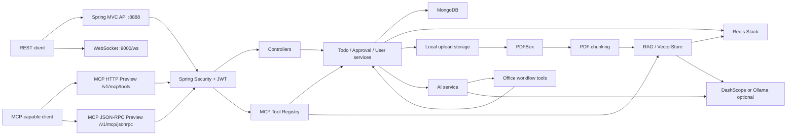

# Flowdesk Architecture

Flowdesk is a Spring Boot backend template for AI-assisted office workflows. It keeps the business modules conventional while placing AI tools and RAG infrastructure behind services that can be replaced or extended.

## Runtime View

## Main Modules

| Module | Package | Responsibility |
| --- | --- | --- |
| HTTP API | `controller` | User, todo, approval, department, group, chat, upload, and diagnostics endpoints |
| Service layer | `service`, `service.impl` | Business orchestration and persistence boundaries |
| Persistence | `repository`, `entity` | MongoDB documents and repositories |
| Security | `security`, `config.JwtProperties` | JWT creation, request filtering, CORS, password encoding |
| Realtime | `websocket`, `config.WebSocket*` | Chat WebSocket handshake and message handling |
| AI tools | `ai.tools` | Tool-callable office actions exposed to the AI layer |
| RAG | `ai.knowledge` | PDF text extraction, chunking, embeddings, Redis Stack storage/search |
| MCP preview | `mcp` | Authenticated HTTP and JSON-RPC preview endpoints that wrap existing services as tools |
| AI config | `ai.config`, `config.AIConfig`, `config.FlowdeskAiProperties` | Provider selection, chat client, memory advisor, DashScope/Ollama options |

## Request Flow

1. A client calls a controller under `/v1/**`.
2. Spring Security validates JWT for protected routes.
3. Controllers delegate to services.
4. Services use repositories for MongoDB-backed business state.
5. AI chat flows call `AIService`. DashScope mode can use Spring AI tools to operate on office modules; Ollama mode provides a no-key local chat path.
6. File uploads can be parsed and indexed for RAG through PDFBox, provider embeddings, and Redis Stack.
7. MCP preview calls enter through `/v1/mcp/**`, pass through existing JWT security, and dispatch through the MCP Tool Registry to existing service and RAG adapters.

## Design Notes

- Keep controllers thin and move business decisions into services.
- Keep AI tool classes small; they should call existing services instead of duplicating business logic.
- Treat MCP endpoints as a preview transport until a standard stdio, SSE, or Streamable HTTP MCP server is added.
- Treat Redis Stack as an infrastructure dependency for knowledge retrieval, not as the source of truth for business entities.
- Keep local files, logs, and secrets outside git.
