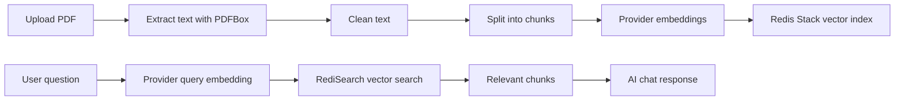

# RAG and Knowledge Retrieval

Flowdesk includes a minimal RAG path for PDF-based knowledge retrieval using the configured AI provider for embeddings and Redis Stack / RediSearch for vector search.

## Flow



## Components

| Component | Package | Notes |
| --- | --- | --- |
| PDF parsing | `ai.knowledge.PDFProcessor` | Extracts text and splits content into chunks |
| Vector store | `ai.knowledge.VectorStoreService` | Handles Redis Stack / RediSearch storage and lookup |
| Citations | `ai.knowledge.RagCitationMapper` | Converts retrieved chunks into public response citations |
| Quality Lab | `ai.knowledge.RagQualityLabEvaluator` | Offline quality checks for retrieved chunks and citations |
| AI tools | `ai.tools.KnowledgeTools` | Exposes knowledge retrieval to AI tool calls |
| Diagnostics | `controller.KnowledgeDiagController` | Dev-only status/search diagnostics |

## RAG With Citations

Use `POST /v1/knowledge/chat-with-citations` to receive the normal AI answer plus the top retrieved source chunks as citations.

Request:

```json
{
  "prompts": "What should employees do before taking leave?",
  "chatType": 0,
  "relationId": "local-demo"
}
```

Response shape:

```json
{
  "code": 200,
  "msg": "success",
  "data": {
    "chatType": 0,
    "data": "Employees should notify their manager before taking leave.",
    "citations": [
      {
        "documentId": "doc:knowledge_java:test-id",
        "documentName": "sample-employee-handbook.pdf",
        "chunkId": 0,
        "pageNumber": null,
        "score": 0.27,
        "snippet": "Attendance policy requires employees to notify their manager."
      }
    ]
  }
}
```

`pageNumber` is currently `null` because the PDF splitter stores chunk index metadata, not exact PDF page ranges. `chunkId` identifies the stored chunk order for the source document.

When `FLOWDESK_AI_ENABLED=false`, or when Redis Stack / embeddings are unavailable, the endpoint still returns a normal chat response and an empty `citations` array.

## Quality Lab

The offline Quality Lab lives in [rag-quality-lab.md](rag-quality-lab.md). It checks retrieved chunks against simple example cases without calling DashScope, Ollama, MongoDB, or Redis.

Run:

```powershell
.\mvnw.cmd "-Dtest=*Rag*,*Citation*,*Quality*" test
```

## Local Demo Asset

Use `docs/examples/sample-employee-handbook.pdf` for local demos. It is synthetic placeholder material and should not be replaced with real company documents in public commits.

## Requirements

- Redis Stack running on `localhost:6379`
- `FLOWDESK_AI_ENABLED=true`
- `FLOWDESK_AI_PROVIDER=ollama` with local Ollama running, or `FLOWDESK_AI_PROVIDER=dashscope` with `DASHSCOPE_API_KEY`
- A compatible embedding model. Ollama defaults to `nomic-embed-text`; DashScope defaults to `text-embedding-v3`.

## Provider Notes

Ollama mode does not require an API key:

```powershell
ollama pull qwen2.5:7b
ollama pull nomic-embed-text
ollama serve

$env:FLOWDESK_AI_ENABLED="true"
$env:FLOWDESK_AI_PROVIDER="ollama"
```

DashScope mode requires a real key:

```powershell
$env:FLOWDESK_AI_ENABLED="true"
$env:FLOWDESK_AI_PROVIDER="dashscope"
$env:DASHSCOPE_API_KEY="your-dashscope-api-key"
```

Vector dimensions must match the Redis Stack index. Flowdesk defaults Ollama indexes to `knowledge_java_ollama_768` and keeps DashScope on `knowledge_java`. If you change `OLLAMA_EMBEDDING_MODEL`, `DASHSCOPE_EMBEDDING_MODEL`, or `FLOWDESK_AI_EMBEDDING_DIMENSION`, rebuild the knowledge index.

## Current Limitations

- This is a backend template, not a managed knowledge-base product.
- Index lifecycle and migration flows are intentionally minimal.
- Production deployments should add access control, document ownership, audit logging, and cleanup jobs.
- Large document ingestion should be moved to background processing before production use.
